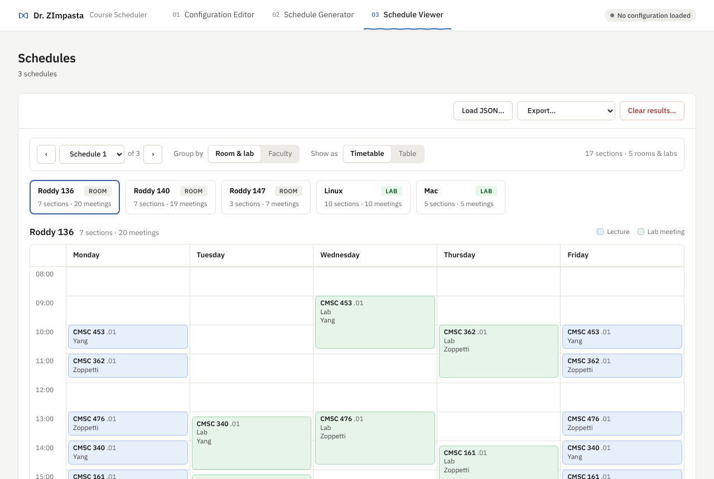

# Dr. ZImpasta

Build course-scheduling configurations, generate schedules, and review or export them.
All scheduling logic comes from the
[course-constraint-scheduler](https://github.com/mucsci/scheduler) library (PyPI
`course-constraint-scheduler`, import name `scheduler`). This repo adds an interactive
shell (Sprint 1) and a graphical interface (Sprint 2) on top of it.

## Setup

You need [uv](https://docs.astral.sh/uv/) for Python and, for the GUI,
[Node.js](https://nodejs.org/) 24 LTS (22.22 or newer works) with the npm that comes with
it (npm 10 or 11). Nothing else needs to be installed globally.

```bash
brew install uv node@24        # macOS; or see the uv and Node.js sites
uv sync                        # Python 3.12, the scheduler library, and dev tools
cd frontend && npm ci && npm run build && cd ..    # the GUI's dependencies and build
```

`uv sync` creates `.venv` (uv downloads Python if needed); prefix Python commands with
`uv run` instead of activating it. `npm ci` installs exactly what `frontend/package-lock.json`
pins, and `npm run build` writes the GUI into `src/zimpasta/web/`, where the Python server
finds it. Run the build again after pulling GUI changes. `frontend/.nvmrc` names the Node
version for `nvm use`.

## The GUI

```bash
uv run zimpasta --gui                       # opens http://127.0.0.1:8000 in your browser
uv run zimpasta --gui examples/sample_config.json   # ... with a configuration open
```

The GUI is a React app (JavaScript, built with Vite) served by the same Python process as
its API, on your computer only (`127.0.0.1`). `--port N` picks the port (otherwise the first
free one from 8000), and `--no-browser` skips opening a browser. Stop it with Ctrl+C. The
configuration and schedules live in that process, so closing the browser tab loses nothing;
stopping the server ends the session, so save first.

The three modes are the tabs at the top: **01 Configuration Editor**, **02 Schedule
Generator**, and **03 Schedule Viewer**. The active tab is underlined and its number
highlighted, and you can switch at any time without losing applied work. The pill at the
top right always shows the configuration's state: *No configuration loaded*, *Incomplete*,
*Unsaved changes (n)*, or *Valid · saved*. A dot on the Generator tab means schedules are
being generated. If the server stops, a banner says so and the page reconnects by itself
once it is back.

**Files.** Configurations and schedules are opened with your browser's file picker and saved
with its save dialog. The server never reads or writes files by itself. In Chrome and Edge,
saving shows the system *Save As* dialog, which asks before replacing an existing file. Other
browsers download the file instead and never overwrite: a second download of `out.json`
becomes `out (1).json`. The editor also asks before *New* or *Load* would discard unsaved
changes, and before leaving a form with changes that haven't been applied.

**Working on the GUI.** `npm run dev` in `frontend/` starts the API (on port 8765) and the
Vite dev server together; open http://localhost:5173, which reloads as you edit.
[docs/gui.md](docs/gui.md) explains how the View is organized and how to add to it.

**The hosted version.** https://dr-zimpasta.pages.dev runs the same GUI with Python in
your browser: no install, one session per tab, at most 5 schedules per run, and slower
solving. Each pull request into `develop` gets its own preview there.
[docs/cloudflare-pages.md](docs/cloudflare-pages.md) explains how it works.

### Schedule Viewer



Schedules appear here as soon as the Generator finishes, or after **Load JSON…**. The
header shows how many there are (*3 schedules*).

- **Move between schedules** with **‹** and **›** (they wrap around), or pick one from the
  *Schedule N* list; *of N* shows the total. The card you selected stays selected as you
  page.
- **Group by** switches between **Room & lab** and **Faculty**. *Room & lab* has a card for
  every room and lab, plus *Online* for online meetings. A lab meeting is shown under its
  lab, and also under the section's room when that room stays reserved during the lab.
  *Faculty* has a card for each faculty member, and each meeting shows where it meets.
- **Show as** switches the selected card between a **Timetable** (Monday to Friday,
  08:00–20:00, lab meetings marked *Lab*) and a **Table** of course, section, type,
  faculty, room or lab, day, and time.
- **Load JSON…** opens a file in the [schedule JSON format](#schedule-json-format). It
  replaces the current schedules only if the whole file is valid. Otherwise every problem
  is listed with where it is in the file (for example *Schedule 1 · section 2 · meeting 1 ·
  day*), and the current schedules stay.
- **Export…** saves *This schedule* or *All schedules* as JSON or CSV. Saving works as
  described under **Files** above, and a message confirms the file name. JSON exports load
  back with **Load JSON…**; CSV is the same format the shell writes.
- **Clear results…** removes every generated and loaded schedule after you confirm. The
  configuration is not affected.

If the schedules can't be read from the server, the page says so and offers **Retry**.
Nothing is deleted.

## The shell

```bash
uv run zimpasta
```

The shell is a REPL with a command prompt. A complete command runs immediately:

```
> load examples/sample_config.json
> delete course "CMSC 476"
> run schedule --limit 5 --optimize yes --format csv --output out
```

A bare verb, or a command missing required parts, starts that command's interactive
prompts for whatever is missing, shows the command it constructed, and runs it:

```
> run
Config file to use [none]: examples/sample_config.json
Maximum number of schedules [100]: 5
...
Running: run schedule --config examples/sample_config.json --limit 5 --optimize yes --format csv --output out
```

`help` lists every command with its usage, `help <verb>` shows one, and `quit` leaves.
Identifiers with spaces are quoted shell-style (`"CS 101"`). Backslashes are ordinary
characters, so Windows paths need no quoting or escaping.
`examples/sample_config.json` is the scheduler library's own department example (17 course
sections, 9 faculty). Its limit is 100, so give `run` a small limit the first time; each
schedule takes a second or two.

A typical session: `load` a configuration, `print` it, edit it with `delete` (and `add` and
`modify` once they land), `save` it, `run schedule` to generate and export, then `display`
the exported file. `display` looks for `.csv` and `.json` files in the directory the shell
was started from, so export there.

## Commands

| Command | Purpose |
| --- | --- |
| `load <path>` | Load and validate a configuration file (bare `load` asks until a file loads) |
| `save <path>` | Save the loaded configuration as JSON (bare `save` offers the loaded file's path) |
| `print` | Show the loaded configuration in readable form |
| `add <course\|room\|lab\|faculty> <id>` | Adds an item to the config file |
| `modify <course\|room\|lab\|faculty> <id> <id_value> <key> <value>` | Modifies an item in the config file, that is uniquely identifiable by the id & id_value, with the key & value inputs |
| `delete <course\|room\|lab\|faculty> <id> [--section N]` | Remove an item after a yes/no confirmation and strip references to it. `--section` picks between entries that share a name, such as two sections of one course. Bare `delete` offers menus |
| `run schedule [--config PATH] --limit N --optimize yes\|no --format csv\|json --output FILE [--overwrite]` | Generate schedules and export them (bare `run` asks for each value) |
| `schedules summary` / `show <n>` / `export <n>\|all --format F --output FILE [--overwrite]` / `clear` | Work with the schedules generated in this session |
| `display` | List the `.csv` and `.json` schedule files in the current directory and show the chosen one as tables |
| `help [<command>]`, `quit`, `exit` | Shell |

Options are `--name value` (or `--name=value`); flags like `--overwrite` take no value.
Verbs, nouns, and choice values are case-insensitive.

## Check before you push

CI runs these on Linux, macOS, and Windows:

```bash
uv run ruff format --check .
uv run ruff check .
uv run pytest
```

and these for the GUI:

```bash
cd frontend
npm run lint
npm run build
npm run build:browser
npm run test:browser
```

`uv run ruff format .` fixes Python formatting in place. `uv run pytest` is the whole test
suite: the Model, the Controller (including every API route), and the shell. It doesn't need
the GUI to be built. `npm run test:browser` runs the browser version's Python in Node; its
first run downloads about 15 MB.

## Architecture (MVC)

Sprint 2 uses Model-View-Controller. The Model and Controller are Python; the View is the
React GUI, which talks to the Controller over a local JSON API. The Sprint 1 shell is a
second view on the same Model.

| Part | Where | Responsibility |
| --- | --- | --- |
| Model | `src/zimpasta/model/` | The configuration being edited, validated by the library; schedule generation; the schedules available to the viewer. No HTTP, no rendering. |
| Controller | `src/zimpasta/controller/` | One `AppController` method per user action, coordinating the Model; the `/api` routes that expose them; error responses; local-only security. |
| View | `frontend/src/` | React pages, forms, tables, dialogs, navigation, and messages. Form drafts live here until the user applies them; everything else goes through the API. |

A user action flows View → `frontend/src/api/client.js` → `/api` route → one
`AppController` method → the Model, and the result flows back the same way. Components never
validate scheduler data or run workflows themselves; the library validates in the Model, and
multi-step workflows (load with unsaved changes, generate then publish results to the viewer,
delete with cascades) live in the Controller, where pytest covers them. The API is documented
in [docs/web-api.md](docs/web-api.md); the View in [docs/gui.md](docs/gui.md).

### Editing rules

- **Every change is validated whole.** An edit builds the changed configuration, the
  library validates all of it, and it is kept only if the library accepts it. A rejected
  edit changes nothing and comes back with the library's messages, each located at the
  area, item, and field it concerns. A valid configuration therefore never becomes
  invalid.
- **Drafts stay in the view.** Forms edit a copy; *Cancel* throws the copy away and the
  Model never sees it. Schedule generation always uses the last applied configuration.
- **New configurations start incomplete.** *New* creates default time slots and class
  patterns (the library example's) with no rooms, labs, courses, or faculty. Until it has
  at least one room, course, and faculty member, the only problems allowed are those
  missing items. It can't be saved or used for generation until it is complete. The
  library can only check names and references across items once all three exist, so
  those checks run on the edit that completes the configuration.
- **Unsaved changes are protected.** Each applied edit is listed until the configuration
  is saved. *New* and *Load* show that list and ask before discarding it.
- **Renames carry references.** Renaming a room, lab, faculty member, or course updates
  every reference to it.

### Deleting referenced items

Rooms and labs are named in courses' room and lab options and in faculty preferences;
faculty members in courses' faculty candidates; courses in other courses' conflicts and in
faculty course preferences. Deleting an item first shows its impact:

- **Blocked** if the item is a section's *only* room, lab, or faculty option, because the
  section would no longer be what it was. The sections are listed so they can be edited.
- **Removed with it** are all other references: an option among several, a preference, a
  conflict. They are listed before the delete is confirmed.
- A course id names all its sections, so references to a course are only removed with its
  last section.

If the library would still reject the result (for example, deleting the last course, or a
class pattern some course needs), the delete is refused with its reasons. Nothing is
changed unless the whole delete succeeds.

### Schedule JSON format

Schedules are exported and imported in the scheduler library's `JSONWriter` format: a list
of schedules, each a list of course assignments.

```json
[[{"course": "CS 102.01", "faculty": "Dr. Jones", "room": "Room 101", "lab": "Lab 101",
   "times": [{"day": 1, "start": 900, "duration": 75, "delivery": "in_person"},
             {"day": 3, "start": 900, "duration": 75, "delivery": "in_person"}],
   "lab_index": 1, "reserve_room_during_lab": true}]]
```

- `day` is 1 (Monday) to 5 (Friday); `start` is minutes after midnight; `duration` is
  minutes; `delivery` is `in_person` or `online`.
- `room`, `lab`, and `lab_index` appear only when assigned; `lab_index` marks which of
  `times` is the lab meeting.
- Import accepts a list of schedules or a single schedule (one list of assignments).
  Export always writes a list of schedules, even for one schedule, so exports load back.
- Files written by the library's own `scheduler` command, by the Sprint 1 shell's
  `schedules export`, and by this GUI are interchangeable (course-constraint-scheduler 3.x).

## Layout

```
src/zimpasta/
  cli.py            shell entry point: welcome page, command prompt, the command registry
  command.py        CommandSpec / Invocation / Registry and evaluate(), the one execution path
  session.py        Session: state shared by every shell command (config, config_path, results)
  console.py        Console protocol (ask / say) and the stdin/stdout implementation
  prompts.py        validated prompts (ask_int, ask_yes_no, ask_choice, ask_menu, ask_format,
                    ask_output_path) and the fixed acceptance-scenario messages
  welcome_page.py   the welcome banner
  view.py           text summary and table for the in-session schedules
  model/            the Model, shared by the shell and the GUI
    workspace.py      ConfigWorkspace: the configuration, validated edits, unsaved changes
    references.py     who refers to what: delete impact, cascades, renames
    issues.py         library validation errors located by area, item, and field
    defaults.py       starting time slots and patterns for a new configuration
    catalog.py        choices and help text for form controls, read from the library
    generation_job.py background generation with per-run overrides, progress, cancel
    schedules.py      ScheduleSet: import, export, room and faculty views
    generate.py       schedule generation through the library's Scheduler
    config_loader.py  load_config(path): read a configuration file (shell)
    config_finder.py  ConfigFinder: look up items by id or name (shell)
    results.py        ScheduleStore: the shell's generated schedules
    export.py         the shell's JSON and CSV export with overwrite protection
  controller/       the Controller
    app_controller.py AppController: one method per GUI action
    routes.py         the /api routes
    errors.py         one JSON error shape for every failure
    security.py       localhost only; no cross-site requests
    static.py         serves the built GUI (src/zimpasta/web/, not committed)
    api.py            create_app(): the FastAPI application
  gui.py            zimpasta --gui: pick a port, start uvicorn, open the browser
  browser.py        the browser version: the API in process on Pyodide (docs/cloudflare-pages.md)
  commands/         one module per shell command, each exposing SPECS
    load_config.py, save_config.py, print_config.py    load, save, print
    add.py, modify.py, delete.py                       add, modify, delete
    run.py, results.py, export_flow.py                 run schedule, schedules ...
    display_schedules.py                               display
    help.py                                            help
tests/
  conftest.py       fixtures: config_data, config, config_file (from tests/fixtures/)
  fixtures/         minimal_config.json: two courses, solved in milliseconds
  helpers.py        ScriptedConsole and a fake scheduler for tests
  model/            Model tests
  controller/       AppController use cases and HTTP API tests
frontend/           the View: React + Vite, JavaScript (see docs/gui.md)
  package.json, package-lock.json, .nvmrc, vite.config.js, eslint.config.js
  src/
    main.jsx, router.jsx, App.jsx, modes.js   entry, routes, frame, the three modes
    api/client.js     every API call
    api/backend.js    the server, or Python in a Web Worker (api/browser/) for build:browser
    state/            app state polling, useAction, toasts
    components/       Button, Card, Dialog, ConfirmDialog, Field, Banner, ...
    layout/           header, connection banner, error pages
    modes/editor|generator|viewer/   one folder per mode
    styles/           design tokens and component styles from the mockups
  scripts/          build-browser.mjs and test-browser.mjs: the browser version
examples/
  sample_config.json   the library's department example
```

## Adding your feature

**GUI features** (the three Sprint 2 modes) start from [docs/gui.md](docs/gui.md): your
mode's folder in `frontend/src/modes/`, calls through `frontend/src/api/client.js`, and any
new server-side workflow as an `AppController` method with pytest tests.

**Shell commands** follow these steps:

1. Branch from `develop`: `git switch -c feat/<your-feature> develop`.
2. Create `src/zimpasta/commands/<feature>.py` with a `SPECS` tuple of `CommandSpec`s.
   Each spec declares the grammar (positionals and options), a **handler**
   `(console, session, invocation) -> None` that does the work for a complete command and
   never prompts for arguments, and a **builder** `(console, session, invocation) ->
   Invocation | None` that asks for whatever required values are missing (use
   `invocation.missing()` and `invocation.with_values(...)`) and returns `None` if the
   user cancels. Read values with `invocation.get("name")`.
3. In `src/zimpasta/cli.py`, add your `SPECS` to `PLACEHOLDERS`. Keep the grammar the team
   agreed on. `commands/delete.py` is a good model to follow.
4. Test with `ScriptedConsole` from `tests/helpers.py`: call `evaluate(console, session,
   "your command line", Registry(SPECS))` for the direct path and a bare verb for the
   builder path, then assert on `console.output` and the `Session`. The `config` and
   `config_file` fixtures give you a small valid configuration to start from. Keep tests on
   that fixture rather than `examples/sample_config.json` so the suite stays fast.
5. Use the library, do not copy it: `CombinedConfig` and its nested models, their
   validation, `Scheduler`, and `scheduler.writers` are the source of truth.
   `CombinedConfig.edit_mode()` applies a group of changes atomically and rolls back on a
   validation error. Never read `examples/sample_config.json` from a command; work on
   `session.config`, and leave writing it to disk to `save`.
6. A `course_id` is not unique: a configuration lists one entry per section, so the example
   has `CMSC 140` twice. Look items up with `ConfigFinder`, which returns every match, and
   decide how your command picks one (`delete` uses `--section`).

## Known limitations

- The native *Save As* dialog exists only in Chromium browsers (Chrome, Edge); elsewhere
  saving downloads the file to the browser's download folder.
- Cancelling generation takes effect after the schedule being solved finishes, since the
  solver can't be interrupted mid-schedule.
- One session per server: two browser tabs share the same configuration and schedules.
- While a new configuration is incomplete, name and reference checks across items run on the
  edit that completes it (see *Editing rules*).
- The browser version generates at most 5 schedules per run, solves about 3× slower, answers
  nothing else while a schedule is being solved, and loses its session when the tab closes.
- The Viewer's timetable covers 08:00–20:00. A meeting outside those hours is cut off or
  left off the grid; the Table view lists every meeting.

## Conventions

- Commit messages follow [Conventional Commits](https://www.conventionalcommits.org/):
  `feat:`, `fix:`, `test:`, `docs:`, `chore:`.
- Open pull requests against `develop` and fill in `.github/PULL_REQUEST_TEMPLATE.md`.
- CodeRabbit reviews each pull request automatically, guided by `.coderabbit.yaml`. It only
  comments; a teammate still approves. A branch created before that file was merged needs
  `develop` merged into it to be reviewed.
- Keep `uv.lock` committed and run `uv sync` after pulling.

## Feature notes

- [docs/gui.md](docs/gui.md): how the GUI is organized and how to build a mode on it.
- [docs/web-api.md](docs/web-api.md): the JSON API between the GUI and the Model.
- [docs/cloudflare-pages.md](docs/cloudflare-pages.md): the browser version on Cloudflare
  Pages, with Python running in the page, and its pull request previews.
- [docs/run-scheduler.md](docs/run-scheduler.md): schedule generation, in-session results,
  and JSON/CSV export in the shell.
- The other commands are documented in their module docstrings: `commands/delete.py`
  (sections and reference stripping), `commands/display_schedules.py` (the CSV and JSON
  layouts it reads), and `commands/load_config.py`, `save_config.py`, `print_config.py`.
